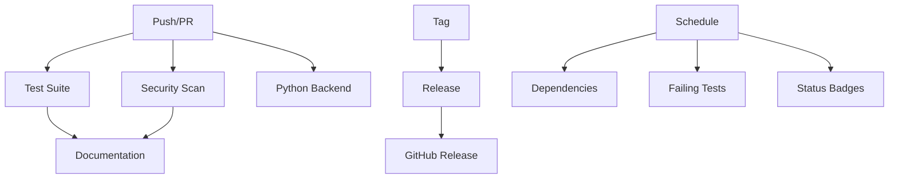

# LedgerPro CI/CD Documentation

This directory contains GitHub Actions workflows for automated testing, building, and deployment of LedgerPro.

## Workflows Overview

### 🧪 Core Testing (`test.yml`)
- **Triggers**: Push to main/develop, PRs to main
- **Features**:
  - Swift package building and testing
  - Parallel test execution
  - Code coverage reporting via Codecov
  - Performance regression detection
  - SwiftLint code quality checks
  - Force unwrap detection in Services/

### 🔒 Security (`security.yml`)
- **Triggers**: Push, PRs, weekly schedule
- **Features**:
  - Secret detection in source code
  - Memory safety with Address Sanitizer
  - Undefined behavior detection
  - Critical path force unwrap monitoring
  - Unsafe string operation detection

### 🐍 Python Backend (`python-backend.yml`)
- **Triggers**: Changes to `LedgerPro/backend/**`
- **Features**:
  - Multi-version Python testing (3.9, 3.10, 3.11)
  - Flake8 linting and Black formatting
  - MyPy type checking
  - Bandit security scanning
  - Safety vulnerability checks
  - Backend-frontend integration testing

### 🚀 Release (`release.yml`)
- **Triggers**: Version tags (v*)
- **Features**:
  - Full test suite validation
  - Release binary building
  - DMG creation for macOS
  - Automated release notes
  - GitHub Release publishing

### 📦 Dependencies (`dependencies.yml`)
- **Triggers**: Weekly schedule, manual dispatch
- **Features**:
  - Swift Package dependency updates
  - Python requirements.txt updates
  - Security auditing of dependencies
  - Automated PRs for updates

### 📚 Documentation (`docs.yml`)
- **Triggers**: Changes to source code or docs
- **Features**:
  - Swift-DocC documentation generation
  - API reference creation
  - Test coverage reporting
  - Documentation coverage validation
  - GitHub Pages deployment

### 🚨 Failing Tests (`failing-tests.yml`)
- **Triggers**: Daily schedule, manual
- **Features**:
  - Monitors known failing tests
  - Isolates core functionality testing
  - Performance baseline maintenance
  - Auto-issue creation when tests are fixed

### 📊 Status Badges (`badges.yml`)
- **Triggers**: Push to main, daily
- **Features**:
  - Real-time status badge updates
  - Build, test, and performance monitoring
  - Automated status reporting

## Configuration Files

### `.swiftlint.yml`
- Comprehensive SwiftLint rules
- Custom rules for LedgerPro-specific patterns
- Force unwrap detection in Services/
- Unsafe string operation warnings

### `pull_request_template.md`
- Standardized PR checklist
- Security and performance validation
- Code quality requirements
- Testing guidelines

## Workflow Dependencies



## Key Features

### 🛡️ Security First
- No force unwraps allowed in Services/
- Automatic secret detection
- Memory safety validation
- Dependency vulnerability scanning

### ⚡ Performance Monitoring
- Large dataset tests must complete under 20 seconds
- Memory usage monitoring for 500+ transactions
- Performance regression detection
- Automatic failure on slowdowns

### 🔧 Code Quality
- SwiftLint with strict rules
- Custom LedgerPro-specific validations
- Documentation coverage tracking
- TODO/FIXME comment monitoring

### 🚀 Automation
- Dependency updates via PRs
- Release automation on version tags
- Documentation deployment to GitHub Pages
- Status badge updates

## Environment Requirements

### GitHub Secrets
- `GITHUB_TOKEN`: Automatic (provided by GitHub)
- `CODECOV_TOKEN`: For coverage reporting (optional)

### Runner Requirements
- **macOS Latest**: For Swift builds and iOS/macOS testing
- **Ubuntu Latest**: For Python backend testing
- **Xcode 15.0+**: For Swift compilation

## Usage

### Running Tests Locally
```bash
# Core Swift tests
cd LedgerPro && swift test --parallel

# Python backend tests
cd LedgerPro/backend && pytest

# Performance tests only
swift test --filter "testLargeDatasetWorkflow|testMemoryPerformanceWorkflow"

# Security checks
swiftlint --strict
```

### Creating a Release
1. Ensure all tests pass on main branch
2. Create and push a version tag:
   ```bash
   git tag v1.0.0
   git push origin v1.0.0
   ```
3. Release workflow will automatically build and publish

### Monitoring Status
- Check GitHub Actions tab for workflow status
- Review STATUS.md for current badge status  
- Monitor weekly dependency update PRs

## Troubleshooting

### Common Issues

**Tests failing on range errors:**
- Check for unsafe string operations (prefix, suffix, dropFirst, dropLast)
- Ensure bounds checking in MerchantDatabase operations
- Review Transaction ID generation safety

**Performance regression:**
- Check if large dataset tests exceed 20-second threshold
- Review memory usage in FinancialDataManager
- Verify transaction processing efficiency

**Build failures:**
- Ensure Xcode version compatibility
- Check Swift package dependencies
- Verify Python backend requirements.txt

### Getting Help
- Check workflow logs in GitHub Actions
- Review failing test output in test summaries
- Consult individual workflow documentation

## Maintenance

### Weekly Tasks (Automated)
- Dependency security audits
- Failing test monitoring
- Performance baseline validation

### Monthly Tasks (Manual)
- Review and update workflow configurations
- Assess code quality metrics
- Update documentation as needed

### Release Tasks (Automated)
- Full test suite validation
- Performance regression checks
- Security vulnerability scanning
- Automated release publishing